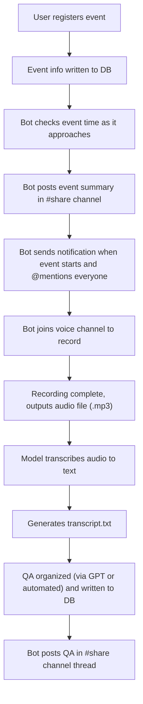

# Event Automation Record Flow

Author: Ian Chien (Ian-I-Chien)

Created: June 21, 2025

## Problem Description

We host voice-sharing events from time to time, but everything — registration, announcements, notifications, and recordings is done manually.  
This flow is designed to automate the whole process using a bot, so we don’t need to do it by hand anymore.  

## Requirements

- Automatically save event registration info to the database via bot.  
- When the event is near, the bot posts a reminder in the #share channel and @mentions subscribers.  
- At the start of the event, the bot joins the voice channel and records the session.
- Use an AI model to transcribe the audio into text.  
- Extract and organize Q&A from the transcript, then post it back to the #share channel.

## Proposed Design

## Next Steps:

- Design the event registration flow, including host assignment 
- Design the database structure and data flow  
- Design the timing system to trigger scheduled actions  
- Review existing commands to see if they can be reused  
- Verify that the bot can record voice and save audio files  
- Verify that the bot can use an AI API to transcribe recordings  

Note: This flow is currently in the design stage.  
Some parts (like voice recording and transcription) may require further technical validation and testing to confirm feasibility.  